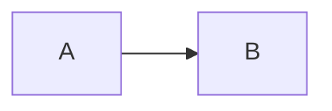

# Usage

## Install

```bash
npx @glitchoff/markify init
```

Copies the scaffold into your project (shadcn `components.json` aware) and installs dependencies. Nothing is imported from the npm package at runtime — everything lives in your repo:

```
components/markify/
├── config.tsx        # settings + theming + component map + <Markify>
├── tokens.css        # shadcn token aliases + fallbacks
└── comps/            # code-block, table, callout, typography, embeds, mermaid, chess, …
```

## Render markdown

```tsx
import { Markify } from "@/components/markify/config";

export function Reply({ text, generating }) {
  return (
    <Markify isStreaming={generating}>
      {text}
    </Markify>
  );
}
```

## Props

Full table in `docs/api-reference.md`. The essentials:

```tsx
<Markify
  isStreaming={false}                 // streaming repair + progressive rendering
  className="max-w-none"              // merged onto the .markify-root wrapper
  spacing="relaxed"                   // vertical rhythm preset
  theme={{ primary: "oklch(0.64 0.19 150)" }}  // shadcn token overrides
  cssVars={{ "--markify-gap": "1.5rem" }}      // raw custom properties
  components={{ blockquote: MyCallout }}       // override any markdown element
>
  {markdown}
</Markify>
```

## Markdown features

````markdown
```ts
// syntax-highlighted, copyable, auto-collapsing
const x = 1;
```

$$\int e^x dx = e^x + C$$

> [!TIP]
> Callouts in 17 tones: NOTE, TIP, HINT, IMPORTANT, WARNING, CAUTION,
> ATTENTION, INFO, SUCCESS, QUESTION, ABSTRACT, TODO, FAILURE, DANGER,
> BUG, EXAMPLE, QUOTE.

| a | b |
|---|---|
| 1 | 2 |



```pgn
1. e4 e5
```

```fen
rnbqkbnr/pppppppp/8/8/8/8/PPPPPPPP/RNBQKBNR w KQkq - 0 1
```


````

Embed prefixes go in the **URL position** of image syntax — plain URLs stay plain images.

## Update flow

- **Restore one component**: `npx @glitchoff/markify add code-block`
- **List components**: `npx @glitchoff/markify add`
- **Full refresh**: re-run `init` — it overwrites the scaffold, so review local changes first (or commit them before re-initializing)

## Migrating from v2.x

1. Run `npx @glitchoff/markify init`
2. Replace `import { Markify } from "@glitchoff/markify"` with an import from your local config
3. Move old component props into `markifyConfig` in `components/markify/config.tsx`:
   - `hljsTheme`, `codeBlockWorker`, `codeFontFamily` → `codeBlock: { … }`
   - `chessEnabled`, `youtubeEnabled`, `twitterEnabled` → `chess.enabled`, `embeds: { … }`
   - `table`, `mermaidConfig` → `table: { … }`, `mermaid: { … }`
   - `renderers`, `components` → `components` prop or edit `buildComponents` in config
   - `themeType` presets (daisyui/radix/bootstrap) were removed — theming is now shadcn tokens + custom overrides only
   - `theme`, `cssVars`, `spacing`, `className`, `isStreaming` props are unchanged
