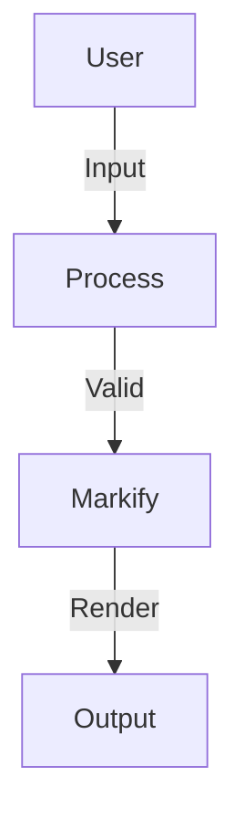

# Diagrams & Math Support

Markify provides out-of-the-box support for **Mermaid diagrams** and **KaTeX LaTeX math equations**.

## 1. Mermaid Diagrams

Markify renders interactive Mermaid flowcharts, sequence diagrams, and class diagrams with built-in zoom, pan, fullscreen, and SVG/PNG/MMD download controls.

### Usage

```markdown

```

### Custom Configuration (`mermaidConfig`)

Pass custom Mermaid settings directly via the `mermaidConfig` prop:

```tsx
<Markify
  mermaidConfig={{
    theme: "dark",
    fontFamily: "Inter, sans-serif",
    flowchart: { curve: "basis" },
  }}
>
  {content}
</Markify>
```

---

## 2. KaTeX Math Equations

Markify uses KaTeX via `remark-math` and `rehype-katex`.

### Import KaTeX CSS
Include KaTeX stylesheet in your application layout:

```tsx
import "katex/dist/katex.min.css";
```

### Inline Math
Write inline equations wrapped in single dollar signs `$`:

```markdown
Einstein's formula: $E = mc^2$
```

### Block Math
Write standalone math blocks wrapped in double dollar signs `$$`:

```markdown
$$
f(x) = \int_{-\infty}^{\infty} \hat{f}(\xi) e^{2\pi i \xi x} d\xi
$$
```
