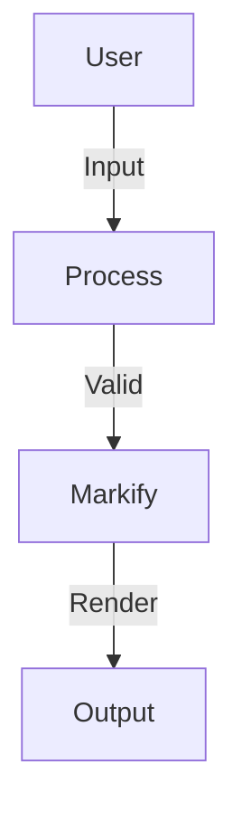
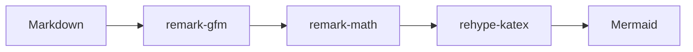
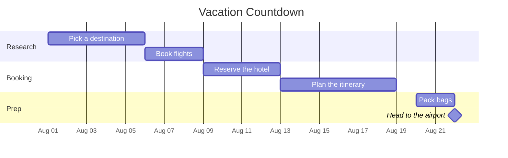
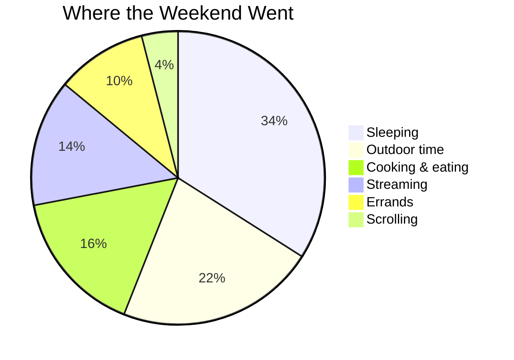
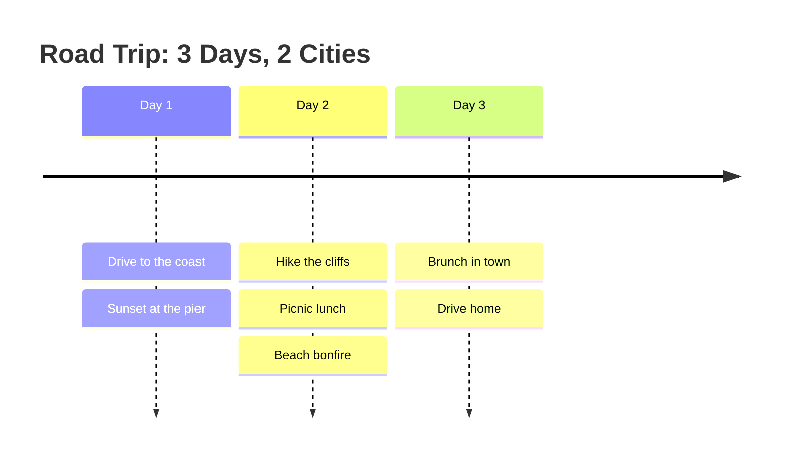

# Mermaid Diagrams

Markify renders interactive [Mermaid](https://mermaid.js.org/) diagrams: flowcharts, sequence diagrams, class diagrams, gantt, state, and more, straight from fenced ` ```mermaid ` blocks.

## 1. Usage

Write a Mermaid diagram inside a ` ```mermaid ` fence:

```markdown

```

### Live example



## 2. Toolbar Controls

Every diagram renders inside a card with a toolbar that provides:

| Control | Action |
|---------|--------|
| **Copy** | Copy the Mermaid source (MMD) to the clipboard. |
| **Download** | Export as SVG, PNG, or MMD. |
| **Fullscreen** | Expand the diagram to fill the screen. |
| **Zoom / Pan** | Zoom in/out and pan around the rendered diagram. |

## 3. Configuration (`mermaidConfig`)

Pass custom settings via the `mermaidConfig` prop. It accepts the full [Mermaid configuration](https://mermaid.js.org/config/) plus Markify-specific UI options:

| Option | Type | Default | Description |
|---|---|---|---|
| `theme` | `string` | Synced with `hljsTheme` | Mermaid theme (`"dark"`, `"default"`, `"forest"`, etc). |
| `showHeader` | `boolean` | `true` | Show the toolbar with copy/download/fullscreen buttons. |
| `showBackground` | `boolean` | `true` | Show the card border and background around diagrams. |
| `fit` | `boolean` | `false` | Auto-fit the diagram to the container width. |

Plus any standard Mermaid option (`fontFamily`, `flowchart`, `sequence`, `themeVariables`, …).

```tsx
<Markify
  mermaidConfig={{
    theme: "dark",
    fontFamily: "Inter, sans-serif",
    flowchart: { curve: "basis", nodeSpacing: 50, rankSpacing: 50 },
    themeVariables: { primaryColor: "#334155" },
    fit: true,
  }}
>
  {markdown}
</Markify>
```

### Minimal / inline look

Set `showHeader` and `showBackground` to `false` for a minimal inline diagram:

```tsx
<Markify
  mermaidConfig={{
    showHeader: false,
    showBackground: false,
  }}
>
  {markdown}
</Markify>
```

### Auto-fit

When `fit` is enabled, diagrams are scaled to fit their container. Users can still zoom and pan; the fit button in the header re-centers:

```tsx
<Markify mermaidConfig={{ fit: true }}>
  {markdown}
</Markify>
```

> [!NOTE]
> The `theme` default syncs with the `hljsTheme` prop, so dark-mode code blocks and diagrams stay consistent. Override it explicitly to decouple the two.

## 4. Examples

Mermaid isn't just for flowcharts. Here are a few diagrams you can drop straight into everyday notes.

### Gantt: planning a trip



### Pie: where the weekend went



### Timeline: a three-day road trip

