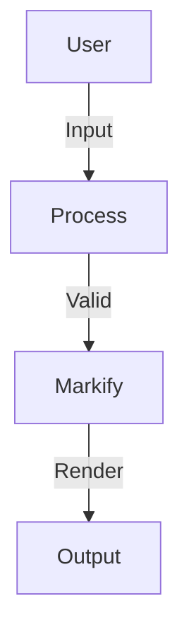
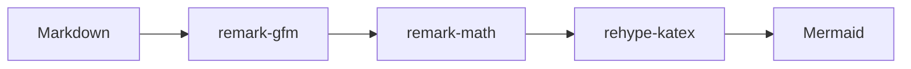
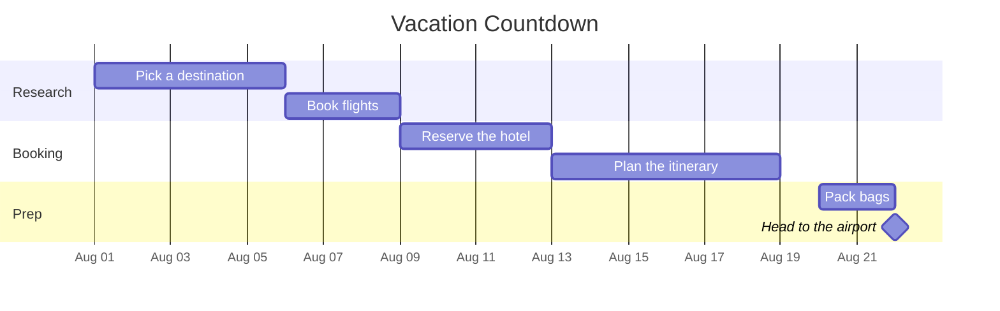
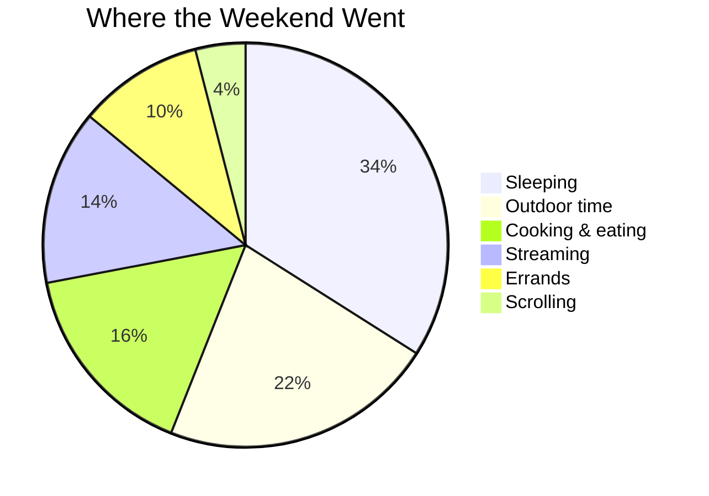
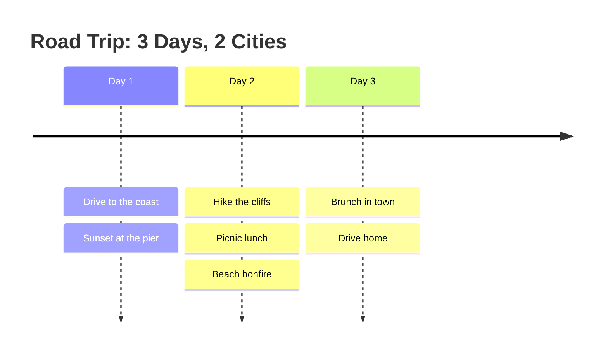

# Mermaid Diagrams

```` ```mermaid ```` blocks render interactive diagrams with zoom, pan, fullscreen, and export built in.

## Syntax

Wrap any [Mermaid diagram](https://mermaid.js.org/) in a fenced code block tagged `mermaid`:

````markdown

````

### Live example



Mermaid isn't just for flowcharts. Here are a few diagram types you can drop straight into everyday notes.

### Gantt: planning a trip



### Pie: where the weekend went



### Timeline: a three-day road trip



## Interactions

- **Pan** — drag the diagram (mouse or touch)
- **Zoom** — buttons bottom-left, Ctrl/Cmd + wheel zooms toward the cursor, pinch on touch
- **Reset** — double-click anywhere, or the reset button
- **Fullscreen** — the toolbar's expand button
- **Export** — SVG, PNG (2× rasterized), or the raw `.mmd` source
- **Copy** — diagram source to clipboard

## Lazy rendering

Diagrams render only when scrolled into view (IntersectionObserver). On render errors, the last valid SVG is kept and an error card offers a retry with the source shown.

## Configuration

```ts
markifyConfig.mermaid = {
  showHeader: true,       // toolbar with copy/download/fullscreen
  showBackground: true,   // card border and background
  fit: false,             // auto-fit diagram to container width
  theme: "dark",          // any mermaid MermaidConfig option passes through
  securityLevel: "loose",
};
```

When `mermaid.theme` isn't set explicitly, it follows the code block theme (`dark` → mermaid `dark`, light → `default`).
