# Mermaid diagrams

Markify renders ```` ```mermaid ```` fences as interactive diagrams — zoom, pan, fullscreen, and export — instead of a wall of syntax.

The default engine is **[Pele](https://pele.run)** (`obsidianmd/pele`): Obsidian's Mermaid-to-SVG renderer. It's synchronous, has zero runtime dependencies, and paints entirely from CSS variables, so diagrams follow your app's palette and switch themes without re-rendering. `mermaid.js` stays available as a fallback for syntax Pele's Mermaid 12.1.0 coverage doesn't handle yet.

Every example on this page is real Pele syntax — they're lifted from Pele's own example gallery and rendered by Markify as you read them.

## Install

```bash
npx markify@latest add mermaid
```

This copies `comps/mermaid.tsx` into your project and adds `pele` (plus `mermaid` if you use the fallback) to your dependencies.

## Configure

```ts
// components/markify/config.tsx
mermaid: {
  showHeader: true,     // copy / download / fullscreen toolbar. Default: true
  showBackground: true, // card border + background. Default: true
  fit: false,           // auto-fit diagram to container width. Default: false
  renderer: "pele",     // "pele" | "mermaid". Default: "pele"
  fallback: true,       // fall back to mermaid.js when Pele can't parse. Default: true
}
```

### Options

| Option | Default | What it does |
| --- | --- | --- |
| `showHeader` | `true` | Toolbar with copy, download, fit, and fullscreen. |
| `showBackground` | `true` | Rounded card border and background around the diagram. |
| `fit` | `false` | Scale the diagram down to fit the container on mount and resize. |
| `renderer` | `"pele"` | Which engine renders the SVG. |
| `fallback` | `true` | On a Pele parse error, retry with mermaid.js before showing an error. |

## Engines

### Pele (default)

- **Synchronous.** `render()` returns an SVG immediately — no async race with streaming tokens.
- **Zero dependencies.** No `d3`, no `dagre`, no `cytoscape`.
- **33 diagram types**, each in its own lazily-loaded chunk. Only what you render is downloaded.
- **CSS-variable theming.** Set `--pele-*` on any ancestor and every diagram repaints.

Markify's `tokens.css` maps Pele's variables onto the `--markify-*` tokens:

```css
--pele-bg: var(--markify-card);
--pele-fg: var(--markify-fg);
--pele-muted: var(--markify-muted-fg);
--pele-line: var(--markify-fg);
--pele-surface: var(--markify-muted);
--pele-surface-alt: var(--markify-secondary);
--pele-border: var(--markify-border);
--pele-accent: var(--markify-primary);
--pele-font: var(--markify-font-sans);
--pele-font-mono: var(--markify-font-mono);
--pele-radius: 4px;
```

Override any of them per-instance to restyle a single diagram:

```tsx
<Markify cssVars={{ "--pele-accent": "oklch(0.65 0.2 280)" }}>
  {content}
</Markify>
```

Charts (`xychart`, `pie`, `quadrantChart`, `radar`, `treemap`) use `--pele-series-1` through `--pele-series-8`.

### mermaid.js (fallback)

Set `renderer: "mermaid"` to use mermaid.js everywhere, or leave `fallback: true` (the default) to let it catch anything Pele rejects. It's dynamically imported, so it never lands in the base bundle unless you actually use it.

> **Version note:** Pele targets Mermaid **12.1.0** syntax. If your content relies on newer syntax, keep `fallback: true` until Pele catches up.

---

# Diagram gallery

All 33 supported types, with working examples.

## Flowchart

The workhorse. Nodes, edges, subgraphs, and per-subgraph direction.

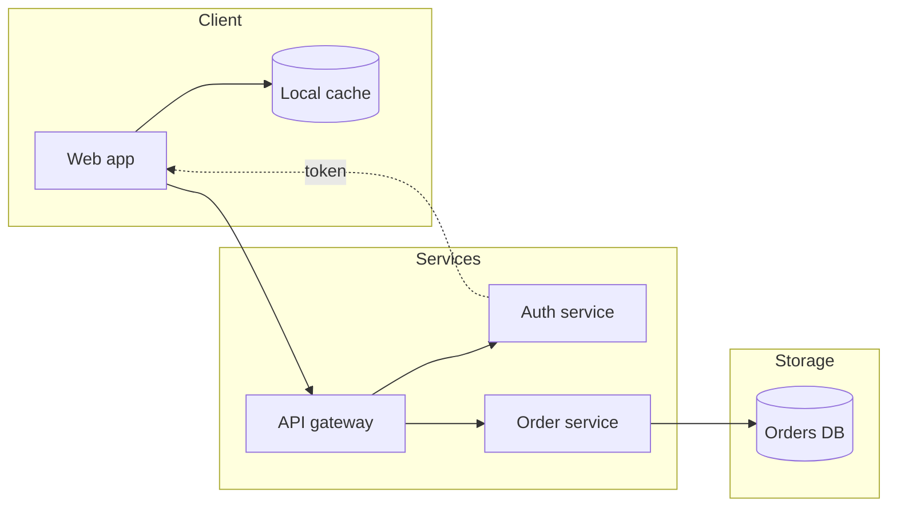
```mermaid
flowchart LR
  subgraph Client
    UI[Web app]
    Cache[(Local cache)]
  end
  subgraph Services
    API[API gateway]
    Auth[Auth service]
    Orders[Order service]
  end
  subgraph Storage
    DB[(Orders DB)]
  end
  UI --> API
  UI --> Cache
  API --> Auth
  API --> Orders
  Orders --> DB
  Auth -. token .-> UI
```

Subgraphs can set their own `direction`, independent of the top-level graph:

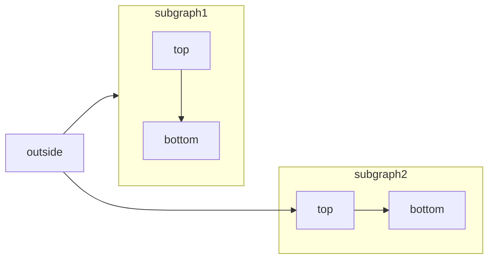
```mermaid
flowchart LR
  subgraph subgraph1
    direction TB
    top1[top] --> bottom1[bottom]
  end
  subgraph subgraph2
    direction TB
    top2[top] --> bottom2[bottom]
  end
  outside --> subgraph1
  outside ---> top2
```

## Sequence

Actors, messages, activation bars, notes, and `autonumber`.

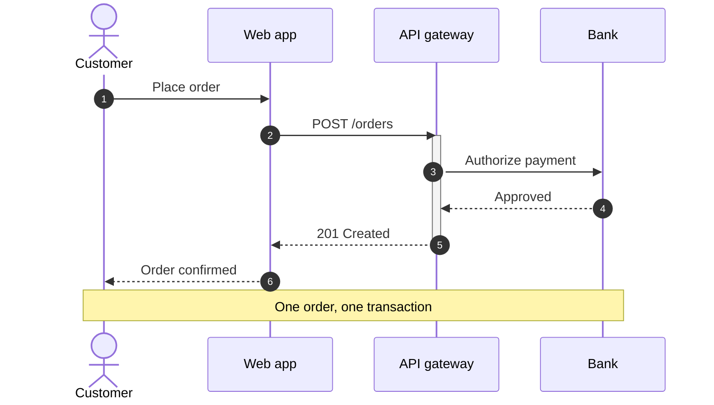
```mermaid
sequenceDiagram
  autonumber
  actor Customer
  participant Web as Web app
  participant API as API gateway
  participant Bank
  Customer->>Web: Place order
  Web->>API: POST /orders
  activate API
  API->>Bank: Authorize payment
  Bank-->>API: Approved
  API-->>Web: 201 Created
  deactivate API
  Web-->>Customer: Order confirmed
  Note over Customer,Bank: One order, one transaction
```

Participants can carry links:

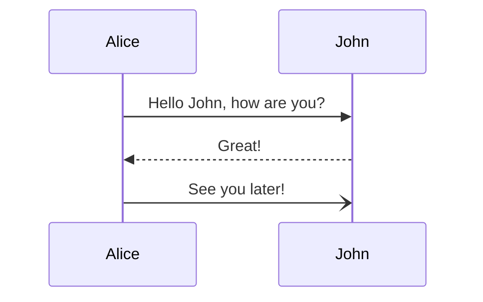
```mermaid
sequenceDiagram
  participant Alice
  participant John
  link Alice: Dashboard @ https://dashboard.contoso.com/alice
  link John: Wiki @ https://wiki.contoso.com/john
  Alice->>John: Hello John, how are you?
  John-->>Alice: Great!
  Alice-)John: See you later!
```

## Class

Classes, members, visibility modifiers, namespaces, and notes.

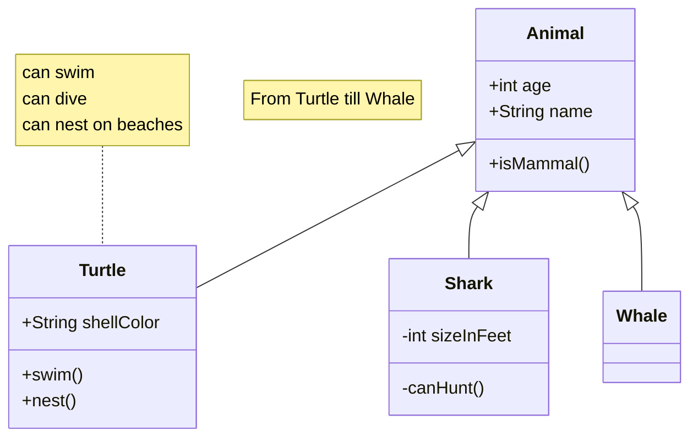
```mermaid
classDiagram
  note "From Turtle till Whale"
  Animal <|-- Turtle
  note for Turtle "can swim<br>can dive<br>can nest on beaches"
  Animal <|-- Shark
  Animal <|-- Whale
  Animal : +int age
  Animal : +String name
  Animal: +isMammal()
  class Turtle{
    +String shellColor
    +swim()
    +nest()
  }
  class Shark{
    -int sizeInFeet
    -canHunt()
  }
```

Namespaces nest with dotted names:

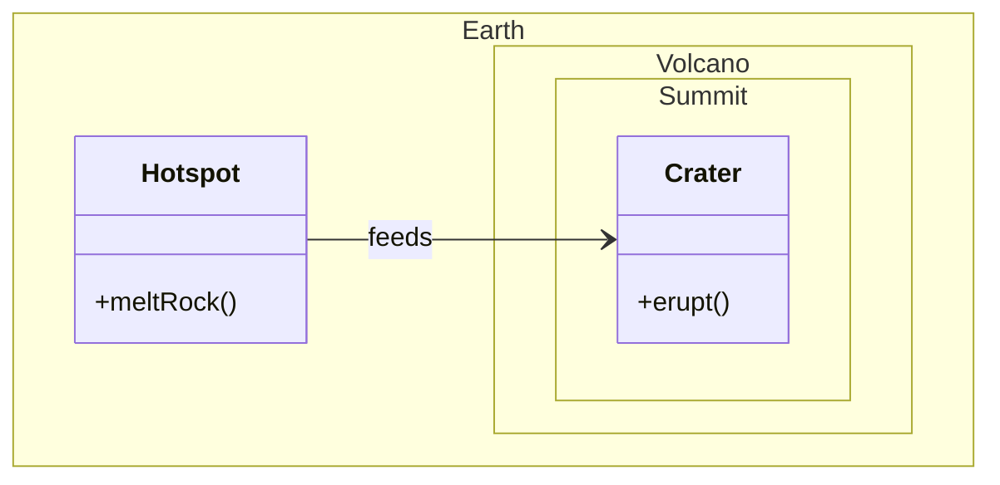
```mermaid
classDiagram
  namespace Earth.Volcano.Summit {
    class Crater {
      +erupt()
    }
  }
  namespace Earth {
    class Hotspot {
      +meltRock()
    }
  }
  Hotspot --> Crater : feeds
```

## State

Composite states, transitions with labels, and parallel regions separated by `--`.

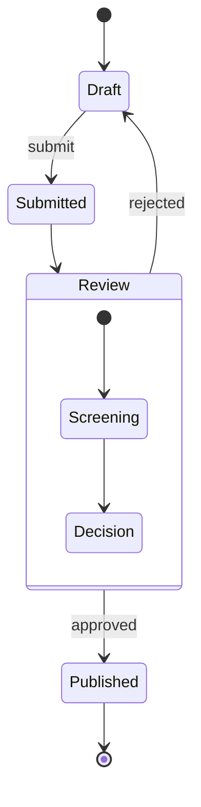
```mermaid
stateDiagram-v2
  [*] --> Draft
  Draft --> Submitted : submit
  state Review {
    [*] --> Screening
    Screening --> Decision
  }
  Submitted --> Review
  Review --> Published : approved
  Review --> Draft : rejected
  Published --> [*]
```

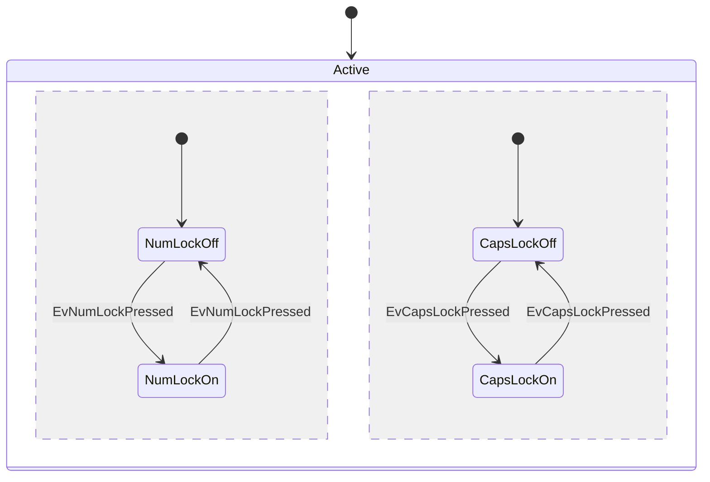
```mermaid
stateDiagram-v2
  [*] --> Active
  state Active {
    [*] --> NumLockOff
    NumLockOff --> NumLockOn : EvNumLockPressed
    NumLockOn --> NumLockOff : EvNumLockPressed
    --
    [*] --> CapsLockOff
    CapsLockOff --> CapsLockOn : EvCapsLockPressed
    CapsLockOn --> CapsLockOff : EvCapsLockPressed
  }
```

## Entity relationship

Cardinality, attributes with keys and comments, and nested subgraphs.

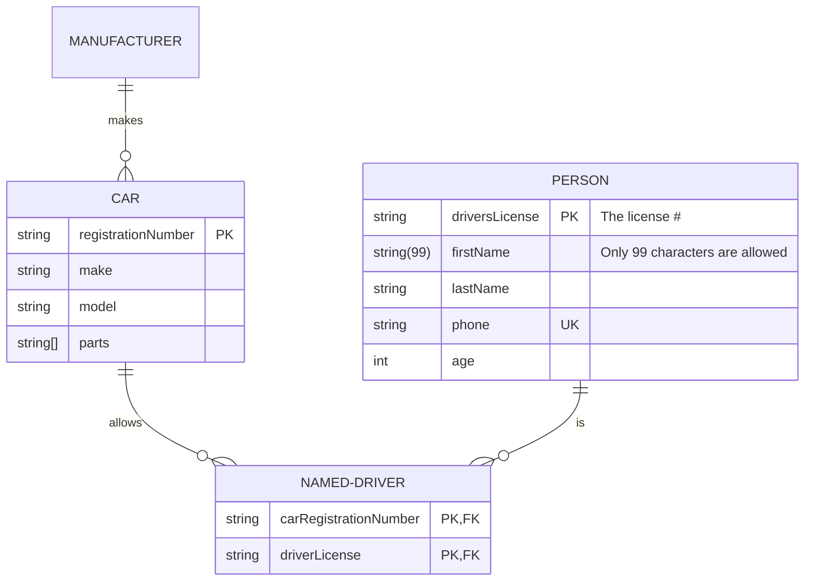
```mermaid
erDiagram
  CAR ||--o{ NAMED-DRIVER : allows
  CAR {
    string registrationNumber PK
    string make
    string model
    string[] parts
  }
  PERSON ||--o{ NAMED-DRIVER : is
  PERSON {
    string driversLicense PK "The license #"
    string(99) firstName "Only 99 characters are allowed"
    string lastName
    string phone UK
    int age
  }
  NAMED-DRIVER {
    string carRegistrationNumber PK, FK
    string driverLicense PK, FK
  }
  MANUFACTURER only one to zero or more CAR : makes
```

## Gantt

Sections, task dependencies with `after`, explicit dates, and durations.

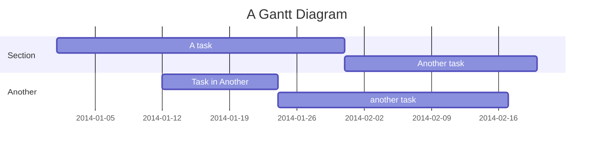
```mermaid
gantt
  title A Gantt Diagram
  %% This is a comment
  dateFormat YYYY-MM-DD
  section Section
    A task          :a1, 2014-01-01, 30d
    Another task    :after a1, 20d
  section Another
    Task in Another :2014-01-12, 12d
    another task    :24d
```

Epoch-based (`dateFormat X`) works for relative timelines:


```mermaid
gantt
  title Git Issues - days since last update
  dateFormat X
  axisFormat %s
  section Issue19062
  71   : 0, 71
  section Issue19401
  36   : 0, 36
  section Issue7441
  9    : 0, 9
```

## Pie

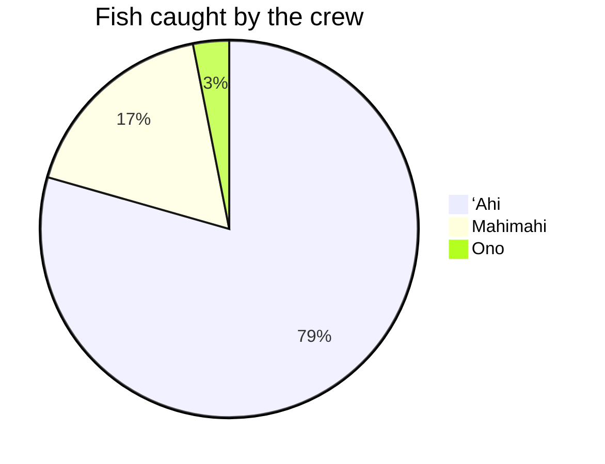
```mermaid
pie title Fish caught by the crew
  "ʻAhi" : 386
  "Mahimahi" : 85
  "Ono" : 15
```

## Timeline

Sections, and multiple events on one date with a bare `:`.

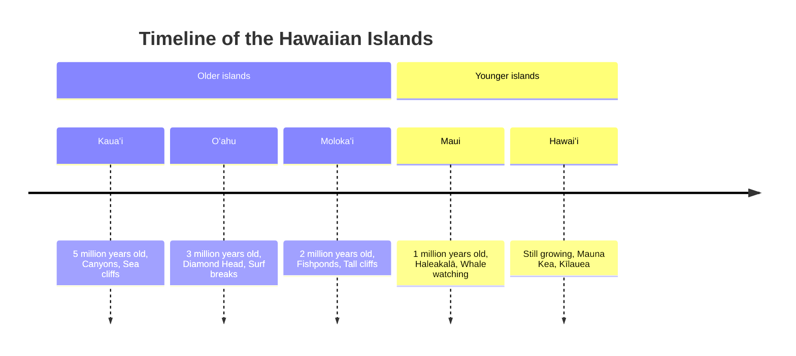
```mermaid
timeline
  title Timeline of the Hawaiian Islands
  section Older islands
    Kauaʻi : 5 million years old, Canyons, Sea <br>cliffs
    Oʻahu : 3 million years old, Diamond Head, Surf breaks
    Molokaʻi : 2 million years old, Fishponds, Tall cliffs
  section Younger islands
    Maui : 1 million years old, Haleakalā, Whale watching
    Hawaiʻi : Still growing, Mauna Kea, Kīlauea
```

## User journey

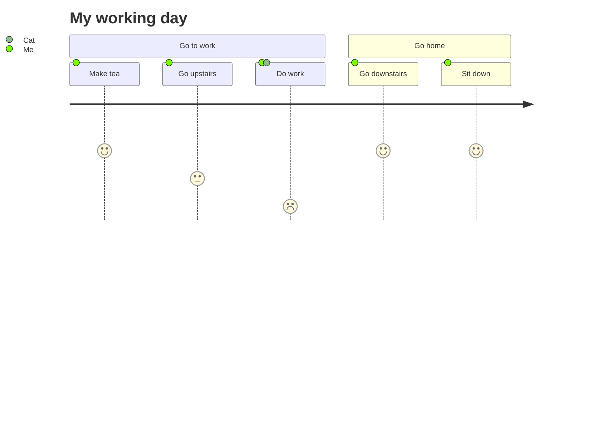
```mermaid
journey
  title My working day
  section Go to work
    Make tea: 5: Me
    Go upstairs: 3: Me
    Do work: 1: Me, Cat
  section Go home
    Go downstairs: 5: Me
    Sit down: 5: Me
```

## ZenUML

Sequence-style diagrams with actor/boundary annotations. Not supported by Pele, so this one always goes through the mermaid.js fallback.

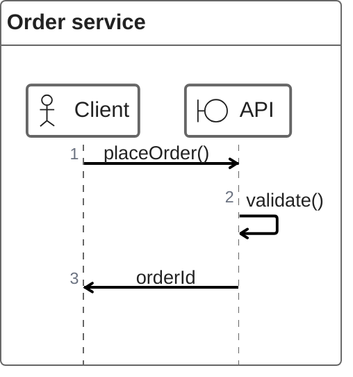
```mermaid
zenuml
title Order service
@Actor Client
@Boundary API
Client->API: placeOrder()
API->API: validate()
API->Client: orderId
```

## Git graph

Branches, merges, cherry-picks, tags, and commit types.

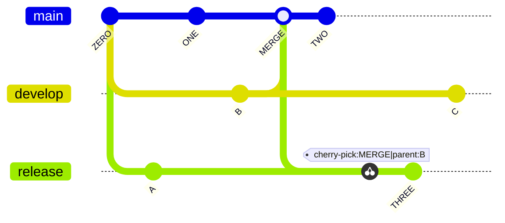
```mermaid
gitGraph
  commit id: "ZERO"
  branch develop
  branch release
  commit id:"A"
  checkout main
  commit id:"ONE"
  checkout develop
  commit id:"B"
  checkout main
  merge develop id:"MERGE"
  commit id:"TWO"
  checkout release
  cherry-pick id:"MERGE" parent:"B"
  commit id:"THREE"
  checkout develop
  commit id:"C"
```

## Quadrant chart

Four named quadrants and points placed in `[x, y]` space.

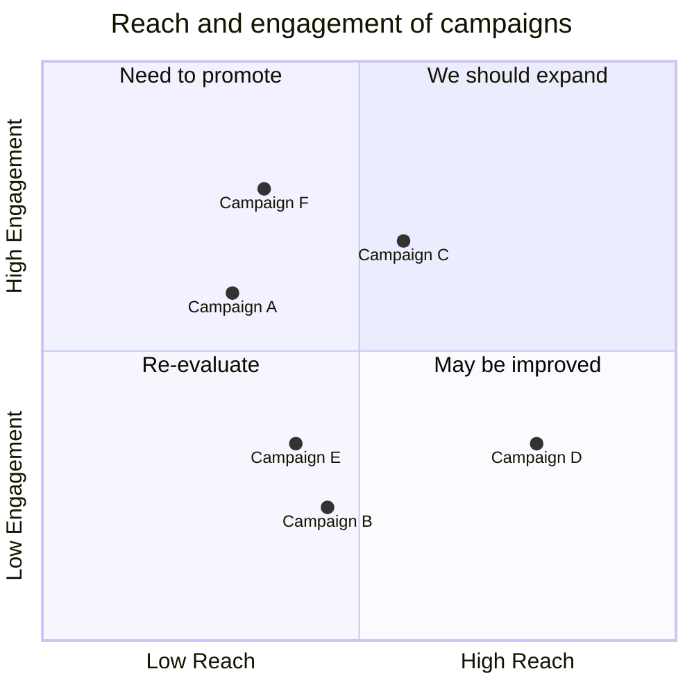
```mermaid
quadrantChart
  title Reach and engagement of campaigns
  x-axis Low Reach --> High Reach
  y-axis Low Engagement --> High Engagement
  quadrant-1 We should expand
  quadrant-2 Need to promote
  quadrant-3 Re-evaluate
  quadrant-4 May be improved
  Campaign A: [0.3, 0.6]
  Campaign B: [0.45, 0.23]
  Campaign C: [0.57, 0.69]
  Campaign D: [0.78, 0.34]
  Campaign E: [0.40, 0.34]
  Campaign F: [0.35, 0.78]
```

## XY chart

Bars and lines on shared axes.

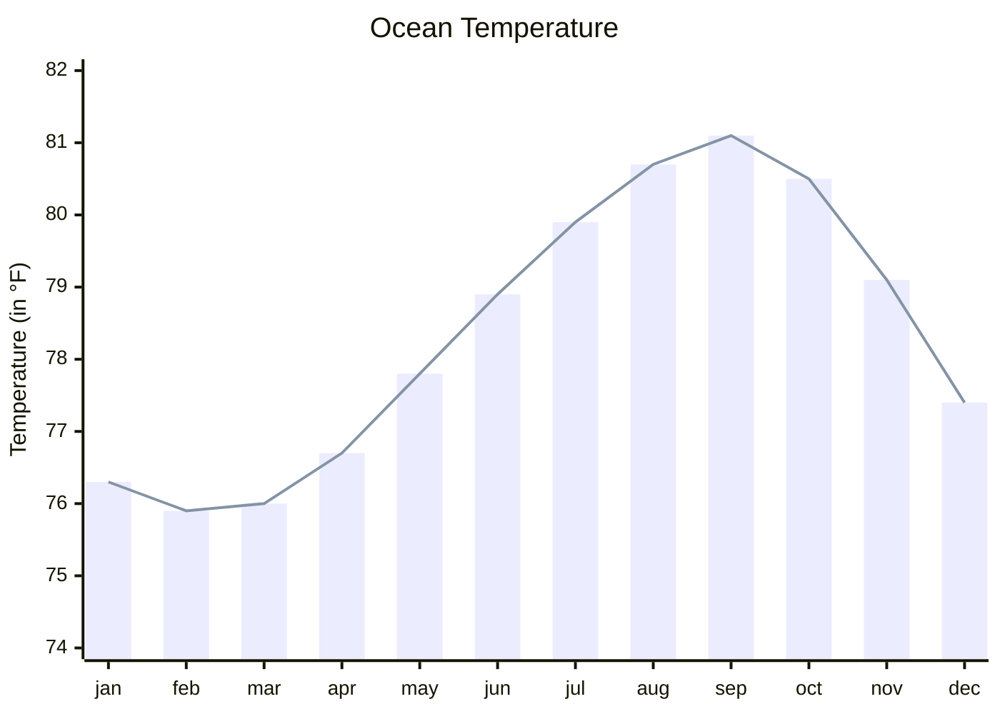
```mermaid
xychart
  title "Ocean Temperature"
  x-axis [jan, feb, mar, apr, may, jun, jul, aug, sep, oct, nov, dec]
  y-axis "Temperature (in °F)" 74 --> 82
  bar [76.3, 75.9, 76.0, 76.7, 77.8, 78.9, 79.9, 80.7, 81.1, 80.5, 79.1, 77.4]
  line [76.3, 75.9, 76.0, 76.7, 77.8, 78.9, 79.9, 80.7, 81.1, 80.5, 79.1, 77.4]
```

## Sankey

Flow volumes as `source,target,value`. The blank line after the keyword is required.

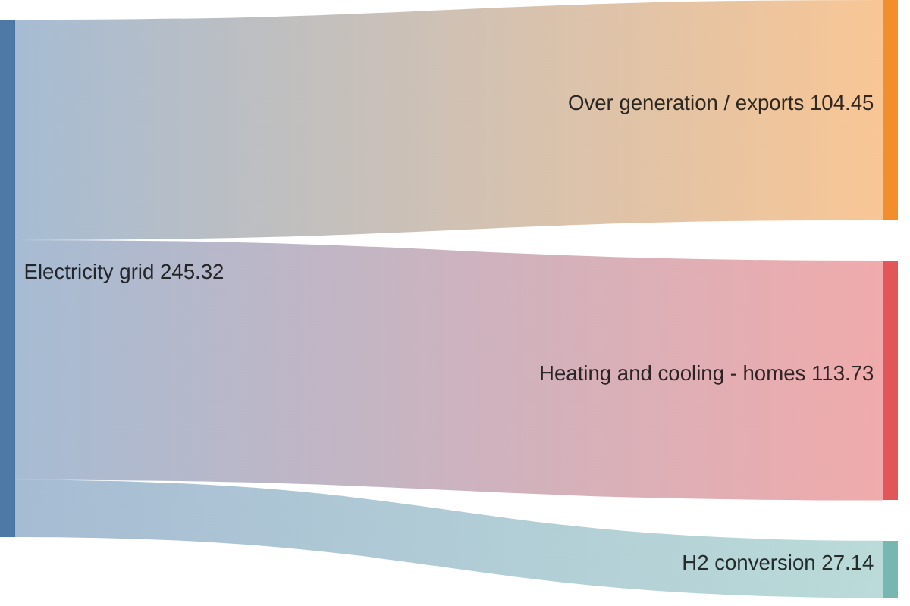
```mermaid
sankey

%% source,target,value
Electricity grid,Over generation / exports,104.453
Electricity grid,Heating and cooling - homes,113.726
Electricity grid,H2 conversion,27.14
```

## Requirement

Requirements, elements, and `contains` / `satisfies` relations.

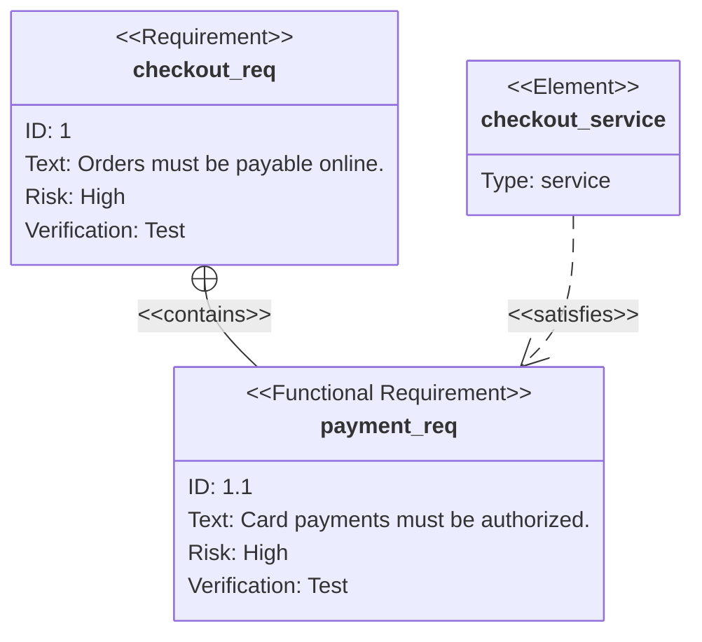
```mermaid
requirementDiagram
  requirement checkout_req {
    id: 1
    text: Orders must be payable online.
    risk: high
    verifymethod: test
  }
  functionalRequirement payment_req {
    id: 1.1
    text: Card payments must be authorized.
    risk: high
    verifymethod: test
  }
  element checkout_service {
    type: service
  }
  checkout_req - contains -> payment_req
  checkout_service - satisfies -> payment_req
```

## Kanban

Columns, cards, and metadata such as `ticket`, `assigned`, and `priority`.

```mermaid
kanban
  Todo
    [Create Documentation]
    docs[Create Blog about the new diagram]
  [In progress]
    id6[Create renderer so that it works in all cases.]
  id9[Ready for deploy]
    id8[Design grammar]@{ assigned: 'knsv' }
  id11[Done]
    id5[define getData]
    id3[Update DB function]@{ ticket: MC-2037, assigned: knsv, priority: 'High' }
```

## C4

Context, container, component, and code diagrams.

```mermaid
C4Component
  title Component diagram for Internet Banking System - API Application

  Container(spa, "Single Page Application", "javascript and angular", "Provides all the internet banking functionality to customers")
  ContainerDb(db, "Database", "Relational Database Schema", "Stores user registration information")
  System_Ext(mbs, "Mainframe Banking System", "Stores all of the core banking information")

  Container_Boundary(api, "API Application") {
    Component(sign, "Sign In Controller", "MVC Rest Controller", "Allows users to sign in")
    Component(accounts, "Accounts Summary Controller", "MVC Rest Controller", "Provides account summaries")
    Component(security, "Security Component", "Spring Bean", "Provides signing in")
    Component(mbsfacade, "Mainframe Banking System Facade", "Spring Bean", "A facade onto the mainframe")
    Rel(sign, security, "Uses")
    Rel(accounts, mbsfacade, "Uses")
    Rel(security, db, "Read & write to", "JDBC")
    Rel(mbsfacade, mbs, "Uses", "XML/HTTPS")
  }

  Rel_Back(spa, sign, "Uses", "JSON/HTTPS")
  Rel(spa, accounts, "Uses", "JSON/HTTPS")
```

## Block

Arrows and nested column layouts.

```mermaid
block
  blockArrowId<["Label"]>(right)
  blockArrowId2<["Label"]>(left)
  blockArrowId3<["Label"]>(up)
  blockArrowId4<["Label"]>(down)
```

```mermaid
block
  columns 3
  a:3
  block:group1:2
    columns 2
    h i j k
  end
  g
  block:group2:3
    l m n o p q r
  end
```

## Packet

Byte-range fields for protocol diagrams. `showBits` / `bitOrder` / `bitsPerRow` are configurable.

```mermaid
packet
0-15: "Source Port"
16-31: "Destination Port"
32-63: "Sequence Number"
64-95: "Acknowledgment Number"
96-99: "Data Offset"
100-105: "Reserved"
106: "URG"
107: "ACK"
108: "PSH"
109: "RST"
110: "SYN"
111: "FIN"
112-127: "Window"
128-143: "Checksum"
144-159: "Urgent Pointer"
160-191: "(Options and Padding)"
192-255: "Data (variable length)"
```

## Radar

Axes, multiple curves, and polygon or circular graticules.

```mermaid
radar-beta
  title Restaurant Comparison
  axis food["Food Quality"], service["Service"], price["Price"]
  axis ambiance["Ambiance"]

  curve a["Restaurant A"]{4, 3, 2, 4}
  curve b["Restaurant B"]{3, 4, 3, 3}
  curve c["Restaurant C"]{2, 3, 4, 2}

  graticule polygon
  max 5
```

## Treemap

Hierarchical areas sized by value.

```mermaid
treemap-beta
"Budget"
    "Operations"
        "Salaries": 700000
        "Equipment": 200000
        "Supplies": 100000
    "Marketing"
        "Advertising": 400000
        "Events": 100000
```

## Ishikawa

Fishbone root causes, with optional nested causes.

```mermaid
ishikawa-beta
    Blurry Photo
    Process
        Out of focus
        Shutter speed too slow
        Protective film not removed
        Beautification filter applied
    User
        Shaky hands
    Equipment
        LENS
            Inappropriate lens
            Damaged lens
            Dirty lens
        SENSOR
            Damaged sensor
            Dirty sensor
    Environment
        Subject moved too quickly
        Too dark
```

## Use case

Actors, system boundaries, and include relationships.

```mermaid
usecase-beta
direction LR
actor Customer
actor Support
systemBoundary Storefront
  Browse("Browse catalog")
  Checkout("Checkout")
end
systemBoundary Fulfilment
  Track("Track delivery")
end
Customer --> Browse
Customer --> Checkout
Customer --> Track
Support --> Track
Checkout ..> : include Browse
```

## Architecture

Services, groups, junctions, and four-way ports (`L` `R` `T` `B`).

```mermaid
architecture-beta
    group sources(cloud)[Sources]
        service src_a(server)[Source A] in sources
        service src_b(server)[Source B] in sources

    group storage(database)[Storage]
        service db_one(database)[DB One] in storage
        service db_two(database)[DB Two] in storage

    group output(disk)[Output]
        service brief(disk)[Brief] in output
        service analyst(server)[Analyst] in output

    src_a:B --> T:db_one
    src_b:B --> T:db_two
    db_two:B --> T:brief
    brief:R --> L:analyst

    align row src_a src_b
    align row db_one db_two
    align column src_b db_two brief
```

## Swimlane

Cross-functional flows, with edges that cross lanes.

```mermaid
swimlane-beta LR
  subgraph Customer
    request[Request service]
    receive[Receive update]
  end
  subgraph Support
    triage[Triage request]
    answer[Send answer]
  end
  subgraph Engineering
    investigate[Investigate issue]
    fix[Prepare fix]
  end

  request --> triage
  triage -->|Known issue| answer
  triage -->|Needs code change| investigate
  investigate --> fix --> answer
  answer --> receive
```

## Venn

Sets, pairwise unions, and text inside regions.

```mermaid
venn-beta
  title What makes a good feature
  set Desirable
  set Feasible
  set Viable
  union Desirable,Feasible["Buildable"]
  union Feasible,Viable["Sustainable"]
  union Desirable,Viable["Marketable"]
  union Desirable,Feasible,Viable["Ship it"]
```

## Wardley map

Value chains with anchors, components, `evolve`, and positioned notes.

```mermaid
wardley-beta
title Tea Shop Value Chain

anchor Business [0.95, 0.63]
component Cup of Tea [0.79, 0.61]
component Tea [0.63, 0.81]
component Hot Water [0.52, 0.80]
component Kettle [0.43, 0.35]
component Power [0.10, 0.70]

Business -> Cup of Tea
Cup of Tea -> Tea
Cup of Tea -> Hot Water
Hot Water -> Kettle
Kettle -> Power

evolve Kettle 0.62
evolve Power 0.89

note "Standardizing power allows Kettles to evolve faster" [0.30, 0.49]
```

## Cynefin

Four domains with items and labelled transitions.

```mermaid
cynefin-beta
  title Strategy Categorization

  complex
    "Market research"

  complicated
    "Competitive analysis"

  clear
    "Standard pricing"

  chaotic
    "Crisis management"

  complex --> complicated : "Pattern identified"
  complicated --> clear : "Best practice codified"
  clear --> chaotic : "Complacency"
  chaotic --> complex : "Stabilized"
```

## Railroad

Grammar diagrams in EBNF or the explicit `sequence` / `choice` form.

```mermaid
railroad-ebnf-beta
title "Arithmetic Expression Grammar"

expression = term ( ( "+" | "-" ) term )* ;
term = factor ( ( "*" | "/" ) factor )* ;
factor = number | "(" expression ")" ;
number = digit+ ;
digit = "0" | "1" | "2" | "3" | "4" | "5" | "6" | "7" | "8" | "9" ;
```

```mermaid
railroad-beta
title Expression Grammar

expression = sequence(
    nonterminal("term"),
    zeroOrMore(sequence(
        choice(terminal("+"), terminal("-")),
        nonterminal("term")
    ))
) ;
number = oneOrMore(nonterminal("digit")) ;
```

## Info

A minimal title card — useful as a placeholder.

```mermaid
info
  title Note
```

## Tree view

File trees with optional icons, highlights, and inline comments.

```mermaid
treeView-beta
    my-project/
        src/
            App.tsx :::highlight ## main component
            index.js ## entry point
        .env ## environment variables
        Dockerfile
        package.json
```

## Agent flow

Agent pipelines: flows, tools, connectors, and collapsed views.

```mermaid
agentflow-beta TB
  flow intake["Intake"]
    receive["Receive request"]@{ shape: input }
  end

  flow processing["Processing"]
    validate["Validate"]@{ shape: task }
    enrich["Enrich"]@{ shape: task }
    validate --> enrich
  end

  flow output["Output"]
    publish["Publish"]@{ shape: action }
  end

  receive --> validate
  enrich --> publish
```

## Event modeling

Timeframes of commands, events, and the data they carry.

```mermaid
eventmodeling

timeframe 01 ui CartUI
timeframe 02 command AddItem [[AddItem01]]
timeframe 03 event ItemAdded [[ItemAdded]]

data AddItem01 {
  description: 'john'
  price: 20.4
}

data ItemAdded {
  description: string
  price: number
}
```

---

## Streaming

Streaming a fence means the source is incomplete on almost every token — `flowchart LR\n  A -->` doesn't parse. Markify handles this by keeping the **last SVG that rendered successfully** and swapping in a new one only when the next attempt succeeds:

```tsx
<Markify isStreaming={isStreaming}>{content}</Markify>
```

A half-written diagram shows the previous frame rather than an error flash. The error card only appears if the very first render fails.

## Toolbar

| Control | Action |
| --- | --- |
| Copy | Copies the Mermaid source to the clipboard. |
| Download → SVG | The rendered vector. |
| Download → PNG | Rasterised at 2× via canvas. |
| Download → MMD | The raw `.mmd` source file. |
| Fit | Re-fit the diagram to the container (shown when `fit` is on). |
| Fullscreen | Expand to fill the viewport. |

## Interaction

- **Zoom** — <kbd>Ctrl</kbd>/<kbd>⌘</kbd> + wheel, anchored on the cursor.
- **Pan** — drag with the mouse, or drag with one finger on touch.
- **Pinch** — two-finger zoom on touch.
- **Reset** — double-click, or the reset button in the zoom panel.

Transform transitions are disabled under `prefers-reduced-motion`.

## Performance

Diagrams render only when they scroll into view (`IntersectionObserver`, 10% threshold). Combined with Pele's per-type chunks, a page with one flowchart downloads only the flowchart parser — not the other 32.

## Error handling

A parse failure shows the message with its line and column, a Retry button, and a collapsible **Show source** panel:

```
Failed to render diagram
Line 2, column 1: Expecting 'NODE_STRING', got 'EOF'
▸ Show source
```

That's what Pele returns for a `flowchart LR` whose edge has no target:

````
```mermaid
flowchart LR
  A -->
```
````

Pele's `PeleError` carries `code` (`syntax` / `semantic` / `unsupported-diagram` / `limit`), `line`, `column`, and a `snippet` pointing at the offending token. Markify reads those fields directly and strips Pele's own `Parse error on line N:` header so the location renders once, not twice.

## Custom rendering

Swap the whole component if you need to:

```tsx
<Markify
  components={{
    pre: (props) => <MyDiagram {...props} />,
  }}
>
  {content}
</Markify>
```

## Next

- [Theming](/docs/theming) — full token reference
- [Streaming](/docs/streaming) — how block-level streaming works
- [Pele examples](https://pele.run/examples) — the source of every diagram above
- [Pele API](https://pele.run/api) — render options, errors, and zoom
